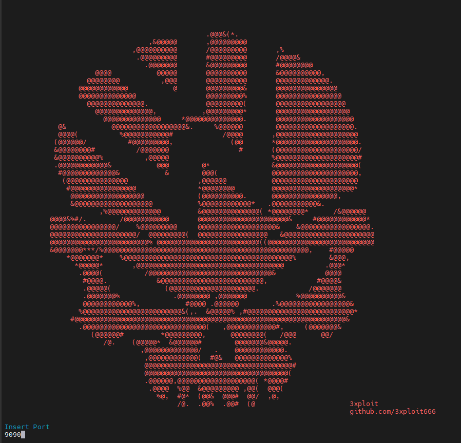
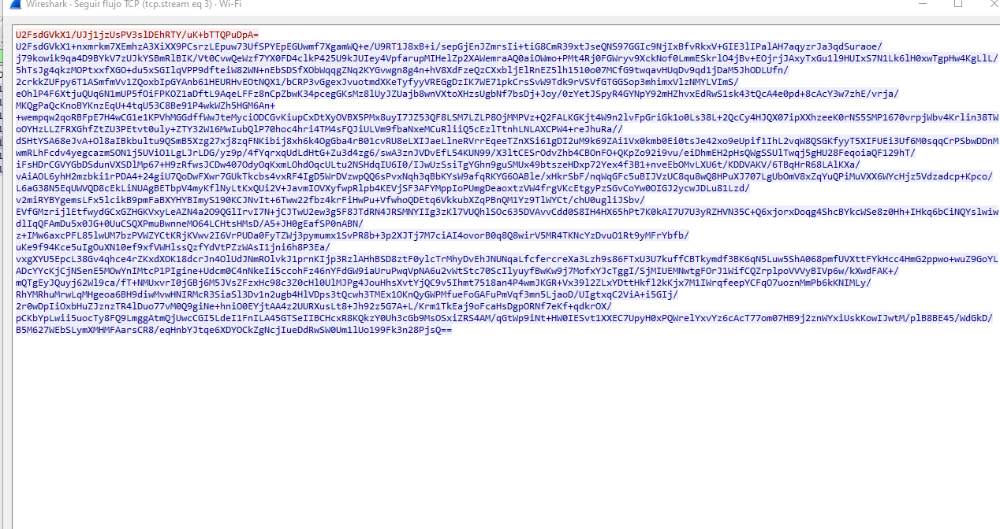
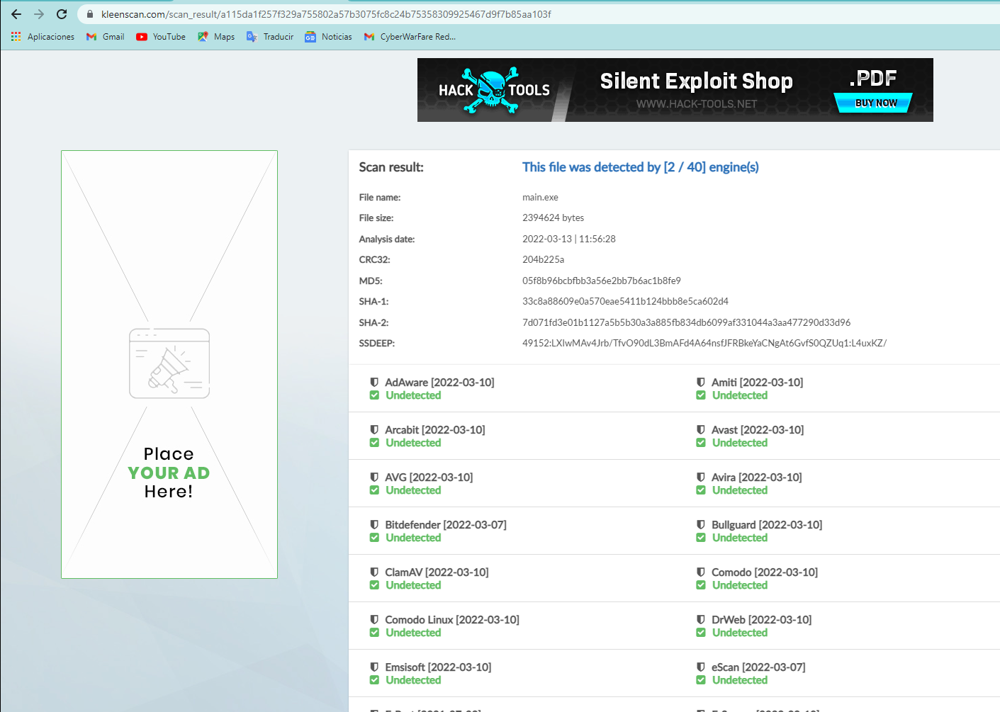

<div align="center">

# 3X-Shell

**AES-Encrypted TCP Reverse Shell**

[](https://golang.org/)
[](https://www.microsoft.com/windows)
[](https://opensource.org/licenses/MIT)

*A Go-based reverse shell with AES-encrypted TCP communications for penetration testing*

[Demo Video](https://youtu.be/ydqtXE37Hb8)

</div>

---

## Overview

**3X-Shell** is a reverse shell written in Go that encrypts all TCP traffic using AES symmetric encryption. By using Go instead of traditional C#/C++/Python payloads, it achieves significantly lower detection rates against AV engines while maintaining native performance through compiled machine code.

## Features

- **AES-Encrypted Traffic** — All C2 communications are encrypted with AES symmetric encryption
- **Low Detection Rate** — 2/40 on ScanTime (as of March 2022)
- **Screenshot Capture** — Remote screenshot functionality
- **Cross-Platform Server** — Listener works on Windows and Linux
- **Native Binary** — Compiled Go binary, no interpreter needed
- **No External Dependencies** — Pure Go implementation

## Detection Rate

| Scanner | Result | Date |
|---------|--------|------|
| ScanTime | **2/40** bypass | March 2022 |

## Screenshots

**Server Listener:**

[](img/server.png)

**Encrypted TCP Traffic (AES):**

[](img/Screenshot_3.png)

**Detection Rate:**

[](img/Screenshot_4.png)

## Build

```bash
# Build the server
go build -o server ./server/

# Build the client (implant)
go build -ldflags "-s -w" -o client ./client/
```

## Usage

```bash
# Start the listener
./server -p 4444

# Execute the client on the target
.\client.exe
```

## Roadmap

- [ ] Multi-stage payload delivery
- [ ] Persistence mechanisms
- [ ] Shellcode injection
- [ ] System information collection

## Legal Disclaimer

> **This tool is intended for authorized penetration testing and security research only.** Unauthorized access to computer systems is illegal. Always obtain proper written authorization before testing. The author assumes no liability for misuse of this software.

## Author

**[@3xploit666](https://github.com/3xploit666)**

---

<div align="center">

*For educational and authorized security testing purposes only.*

</div>
